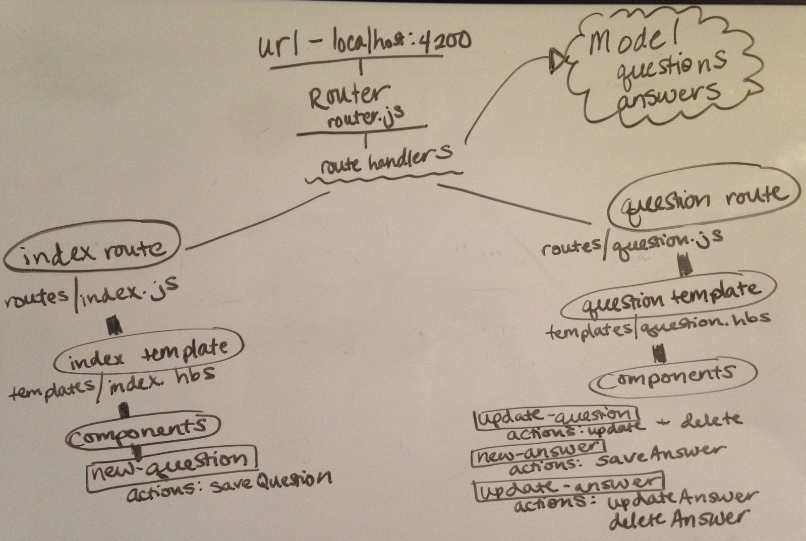

# Ctrl.Alt.Del
### Technology Message Board
Current Version: 1.0 - 04.28.2017

### Description

Web based message board using Ember.js framework. Users can ask and answer computer and technology related questions.

### By Gloria Friesen

## Installation/Setup

* In the terminal, run:
  * `git clone <https://github.com/GloriaFriesen/message-board>`
  * `$ cd message-board`
  * `$ npm install`
  * `$ bower install`
  * `$ ember s`
* In your browser, go to [http://localhost:4200](http://localhost:4200)

## Preparations
|Stuff it needs|Stuff it wants|Stuff it would love to have|
|--------------|--------------|---------------------------|
|Questions: query, author, notes|Footer: links to github/linkedin, author|User model|
|Answers: content, author|Modals: forms, may need jquery|Tags|
|Navbar: application name, link to homepage|Delete question|Awesome design|
|Homepage: list all questions, link to question detail page, add question|Delete answer|Great theme|
|Question page: display all question info, update question, add answer|Styling||

## Application Map

## Known Bugs
We'll see.

## Support and contact details
Questions? Concerns? Suggestions? Reach out to me via github: <https://github.com/GloriaFriesen>.

## Technologies Used
* _Ember.js_
* _JavaScript_
* _HTML_
* _CSS_
* _npm_
* _Bower_
* _Bootstrap_

## License
This software is licensed under the MIT license.
Copyright (c) 2017 Gloria Friesen.
